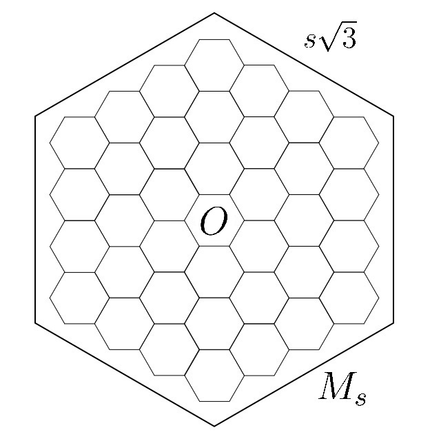

Scroll down for Russian description (to be done).
# AroundPercolationProblem
This is a repository containing source code for experiments, described in the paper [ 	arXiv:1908.11783](https://arxiv.org/abs/1908.11783). For quick demo check out this colab notebook: [](https://colab.research.google.com/drive/1qj00u0uQekl5hk8xXOYHhAajifYt1pBc?usp=sharing)

Assume we have a hexagonal lattice. Consider the hexagon with $s$ cells in its side.
<!-- This repo -->
<!--  -->

This repository contains two main parts: the code for running the experiments (written in C++) and the code for analyzing the results of the experiments. The latter part is given in two alternative ways: and interactive python notebook or simple python script.

## Table of Contents

* **[Content of the repository](#content-of-the-repository)**
* **[Requirements](#requirements)**
* **[How to run the code](#launch-experiments)**
  * [Run C++ experiments](#run-c-experiments)
  * [Run Python analysis](#run-python-analysis)
* **[Examples](#examples)**

## Content of the repository

The file `sampler.cpp` contains the code to run the experiments.

The file `analyze_data.ipynb` contains Python code to generate interactive plots based on the generated data. The demo of this file is available online: [](https://colab.research.google.com/drive/1qj00u0uQekl5hk8xXOYHhAajifYt1pBc?usp=sharing)

The file `analyze.py` contains Python script which do the same analysis as in the `.ipynb` file, but it save all the plots in the `output_images` folder in the `.pdf` format.

## Requirements

To run the C++ code it is needed to be compiled. You need a compiler which supports the `C++17` standard. For Windows we advise `MinGW` compiler. You can download it [here](https://www.mingw-w64.org/downloads/). For linux we advise `GCC, the GNU Compiler Collection`. It is pre-installed on many linux systems.

To run the Python code you need a python interpreter and several python libraries.
We advise installing python via anaconda, see this [link](https://www.anaconda.com/products/distribution). You need the Python version `3.6` or newer.
To install all python requirements run the following command in the terminal:
```bash
python -m pip install -r requirements.txt
```

## Launch the code

### Run C++ experiments
The c++ code should be compiled to run it.
On Linux the code can be compiled with the following command in the terminal:
```bash
g++ sampler.cpp -std=c++17 -O3 -Wall -Werror -Wsign-compare -o sampler.exe
```
This will produce `sampler.exe` file which you can launch in the terminal.
You can run experiments by running
```bash
./sampler.exe --test
```
You can run experiments by simply launching the executable:
```bash
./sampler
```
You will need to input the sizes of the hexagon, the number of liquids and the number of samples.
This will produce several `.csv` files in the folder `results_csv`.
Each line of the file will contain zeros and ones separated by colons. The `i`-th symbol denotes if the `i`-th liquid has percolated. 

### Run Python Analysis

Once you have some data in the `result_csv` folder you can run the python code to create some plots.

A simple way to run the analysis is to run the `analyze.py` script. You can do so by running the following command in the terminal:
```bash
python analyze.py
```

Another way is to launch the `analyze_data.ipynb` notebook. For this you need to launch the jupyter-notebook server. You may do this in the anaconda GUI, or by running the following command:
```bash
jupyter-notebook
```
Afterwards you can launch the `analyze_data.ipynb` file in you browser.
## Examples
All the plots, based on my data is available in: [](https://colab.research.google.com/drive/1qj00u0uQekl5hk8xXOYHhAajifYt1pBc?usp=sharing)

Here are some plots, created by the python notebook.


# Некоторый особенности протекания нескольких жидкостей на шестиугольной решетке.

## Содержание
* **[Содержимое репозитория](#содержимое-репозитория)**
* **[Зависимости](#зависимости)**
* **[Как запустить код](#как-запустить-код)**
  * [Эксперименты на C++](#эксперименты-на-c)
  * [Построение графиков на Python](#построение-графиков-на-python)
* **[Примеры](#примеры)**

## Содержимое репозитория

## Зависимости

## Как запустить код

### Эксперименты на C++

### Построение графиков на Python

## Примеры